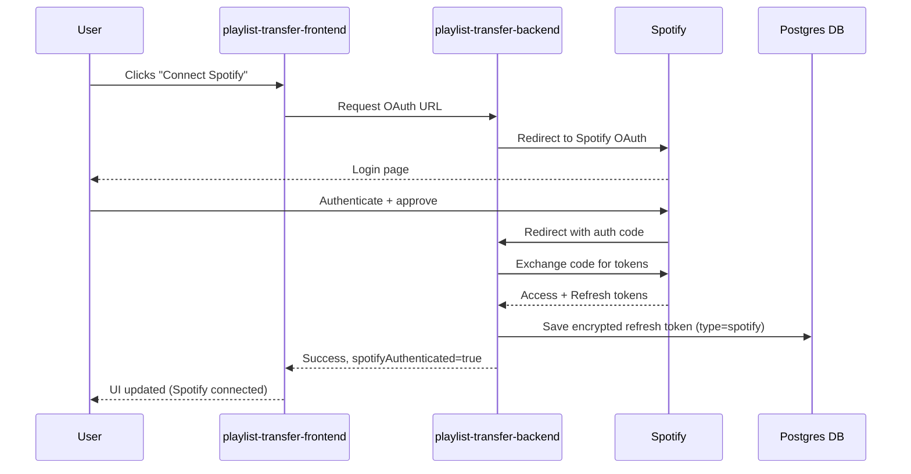
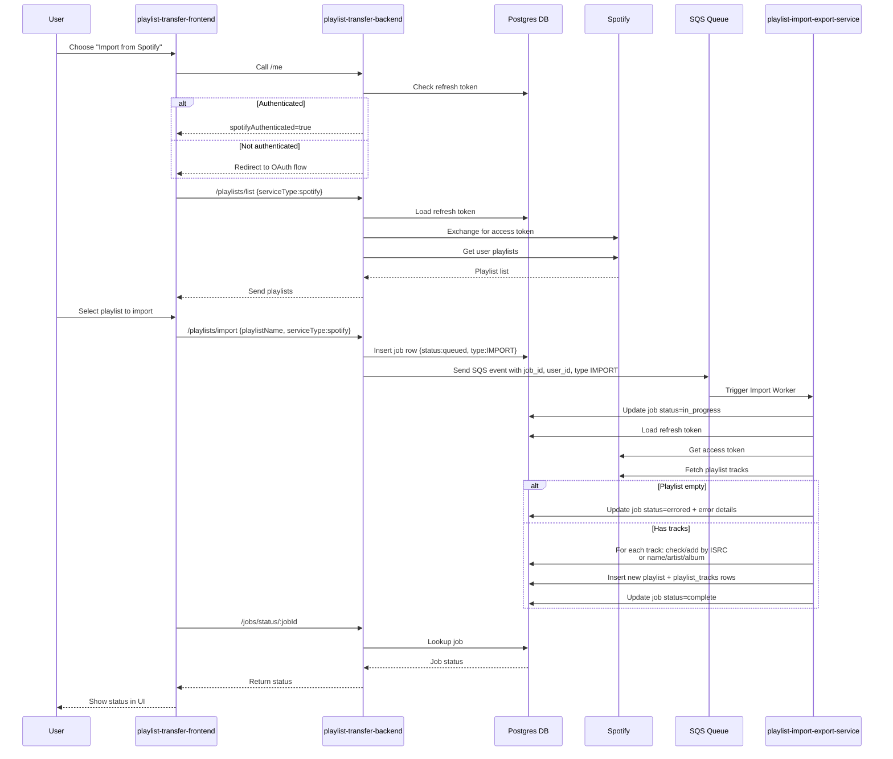
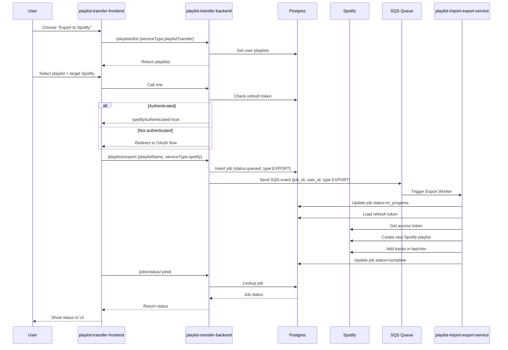

# Playlist Transfer Frontend

[Try the mock-up here!](https://milesbb.github.io/playlist-transfer-frontend/)

This repository contains the **frontend** for the Playlist Transfer website, built using **React**, **Vite**, and **Tailwind CSS** (also using **HCaptcha** for extra security).

The project's main goal is to make it easy for people to archive and transfer their music playlists between apps/providers. Down with the walls between music providers!

This is part of a wider full-stack project, [check out the backend here](https://github.com/milesbb/playlist-transfer-backend) and [check out the python based playlist import/export service here](https://github.com/milesbb/playlist-import-export-service)!

**Currently in early infancy and under construction, come back later!**

---

## Architectural Flow Diagrams

Below are the main architectural flows that describe how the system interacts across services.

If you're trying to view these locally on VSCode and it's not rendering, use [Markdown Preview Mermaid Support](https://marketplace.visualstudio.com/items?itemName=bierner.markdown-mermaid)

Check out the mentioned repositories here:

- [playlist-transfer-frontend](https://github.com/milesbb/playlist-transfer-frontend)
- [playlist-transfer-backend](https://github.com/milesbb/playlist-transfer-backend)
- [playlist-import-export-service](https://github.com/milesbb/playlist-import-export-service)

---

### 1. Third Party Music Service OAuth Flow (Spotify Example)

---

### 2. User Imports Playlist from Spotify

---

### 3. User Exports Playlist to Spotify

---

# Wanting to Contribute?

This is not a super serious project and still in it's early infancy. In the future, I may begin to create small 'easy first issue' issues that people can pick up to get some experience working on a project. In general though feel free to comment on anything, always down to discuss and learn!

Feel free to also hit me up/learn more at [my website 'milesbb.tech'](https://milesbb.tech) or on [LinkedIn](https://www.linkedin.com/in/milesbaileybraendgaard/)!

# License

This project is licensed under the MIT License.
